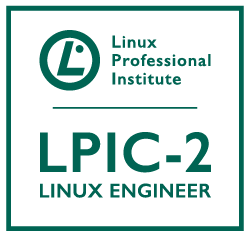
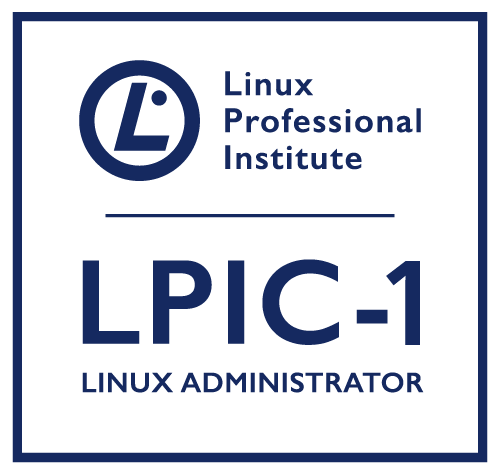
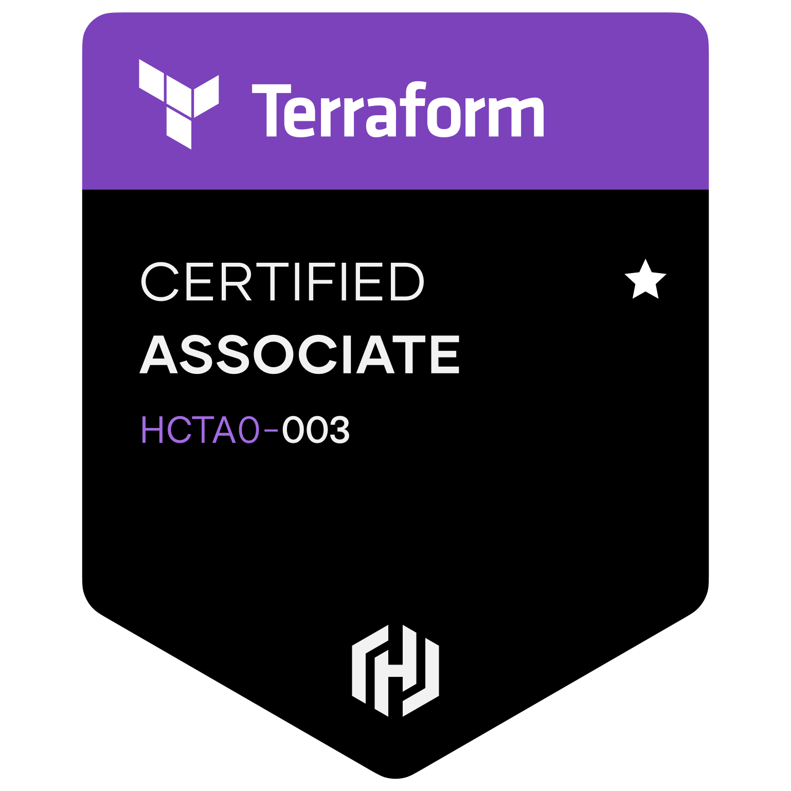
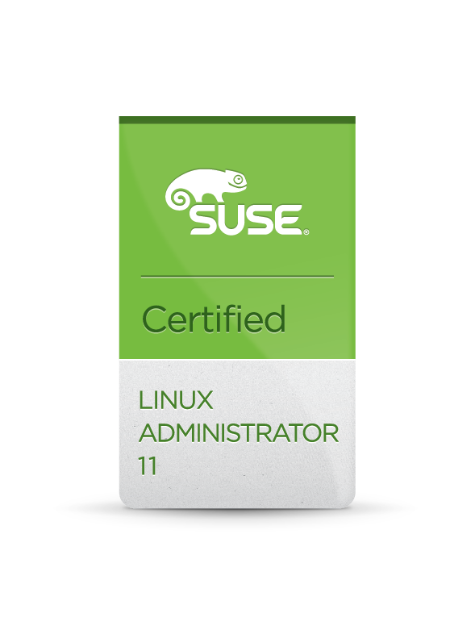
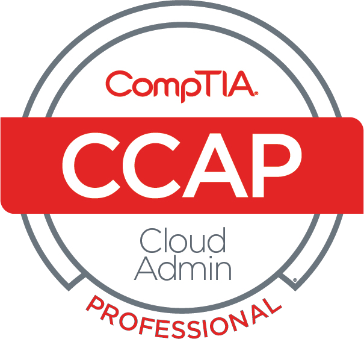
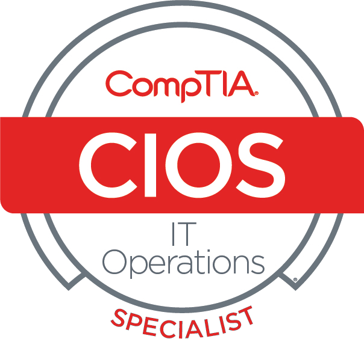
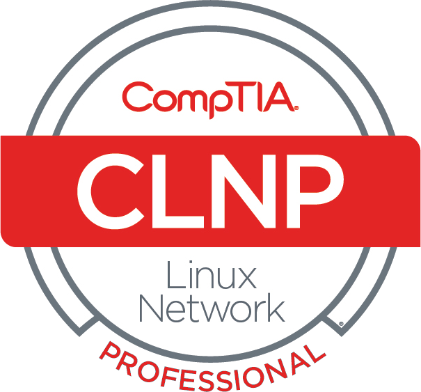
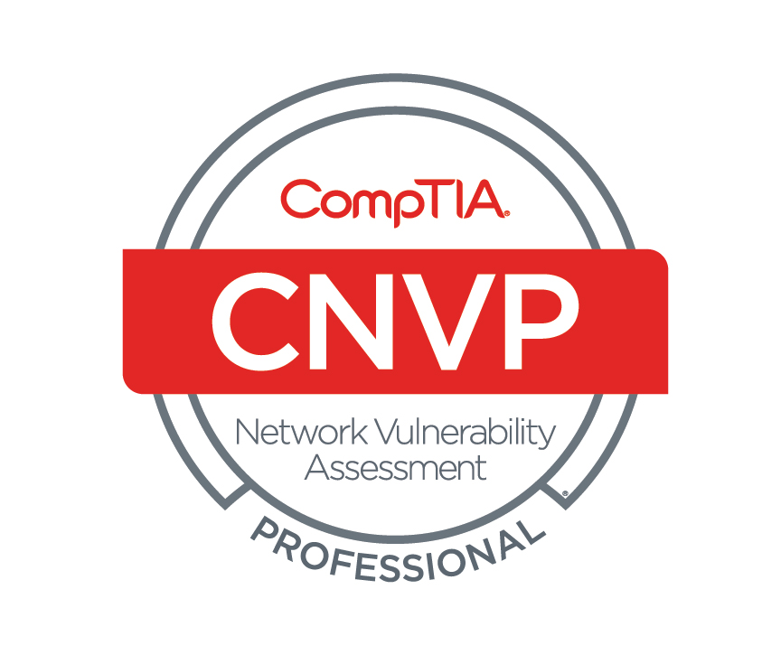

# Chris Murray
<table>
  <tr>
    <th align="left" valign="top" width="600">
      
LinkedIn: www.linkedin.com/in/chris-murray-607aab6a

      
Git Hub:  www.github.com/927technology

       
      <table>
        <tr>
          <td>Oracle</td>
          <td>2021 - Present</td>
        </tr>
        <tr>
          <td>SMS Data</td>
          <td>2017 - 2021</td>
        </tr>
        </tr>
          <td>Agile Defense</td>
          <td>2014 - 2017</td>
        </tr>
        <tr>
          <td>Gulf Coast Shipyard</td>
          <td>2014</td>
        </tr>
        <tr>
          <td>Singing River Hospital</td>
          <td>2013 - 2014</td>
        </tr>
        <tr>
          <td>Pellerin Milnor</td>
          <td>2013</td>
        </tr>
        <tr>
          <td>Biloxi Public Schools</td>
          <td>2000 - 2012</td>
      </table>
    </th>
    <th width="300" wrap="left">
      
      
      
      
      
      
      
            
      
      
      
      
      
      
      
      
      
            
      
    </th>
</table>